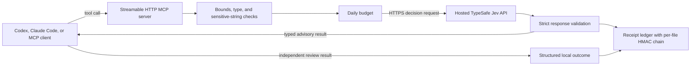

# Architecture

Jev Native MCP is a thin policy and validation layer around the hosted TypeSafe
Jev API. The server owns the data boundary, tool schemas, provider request
construction, response validation, local spend accounting, and receipts. The
MCP client retains reasoning, approval, and action authority.

## System view

The client-to-server connection is either loopback or a private network route.
The server-to-provider connection is outbound HTTPS. These are separate trust
boundaries: decision payloads do not stay on the MCP host.

## Components

### MCP server

`server/server.py` uses the Python MCP SDK and exposes stateless Streamable HTTP
at `/mcp`. The default listener is `127.0.0.1:8765`.

At startup the server:

1. requires a plausible `TYPESAFE_API_KEY`;
2. requires an independent receipt HMAC key containing at least 32 UTF-8 bytes;
3. validates the budget and receipt stores, including retained receipt chains
   and a write probe;
4. accepts only an explicit loopback or private IP bind;
5. enables MCP DNS-rebinding protection;
6. configures a 256 KiB request-body ceiling; and
7. registers typed tools with read/write and open-world annotations.

The server does not include TLS termination or client authentication. Those
must be provided by the deployment boundary if loopback is not used.

### Local policy layer

Every decision call passes through local checks before provider egress:

- the caller declares `data_class` as exactly `public` or `synthetic`;
- strings, identifiers, collection sizes, and serialized state are bounded;
- common credential patterns are rejected;
- specialized tools construct their own fixed decision contracts;
- paid calls are serialized and preflighted against the daily budget; and
- the pinned model is inserted server-side.

The sensitive-string screen is deliberately a last guard. It cannot determine
whether arbitrary prose is confidential, personal, proprietary, or an
unpublished hypothesis. Classification remains the caller's responsibility.

### Provider adapter

The adapter sends canonical JSON to TypeSafe's `/v1/systemone` endpoint using
the pinned `jev-1.13.0` model. Pinning reduces alias drift; it does not make
answers deterministic. The client does not inherit ambient HTTP proxy settings.

Provider calls have a 30-second client timeout. HTTP `429` and `529` responses
receive bounded retries, with no more than three upstream attempts and no more
than five seconds of delay for one retry. Other HTTP failures fail the tool
call. There is no fallback model and no response cache.

Successful responses must contain:

- a model identifier;
- non-negative integer input and output token counts;
- exactly one answer for every requested question;
- the expected answer type for each question; and
- finite, bounded probabilities and complete distributions.

Choice answers must select a declared maximum-probability option. Score answers
must match the declared scale. Malformed success responses fail and are charged
using a conservative local estimate, with one failure receipt when local
storage remains healthy.

### Budget ledger

`DailyBudget` maintains a small JSON file containing the UTC date, estimated
spend, and request count. A preflight reserves the request's UTF-8 byte length
as a conservative token upper bound, and successful calls are reconciled using
the provider's reported input tokens.

The default ceiling is USD 0.10 per day and can be changed with
`JEV_DAILY_BUDGET_USD`. This is a local guardrail, not a provider billing limit.
Store validation runs before provider egress. A persistence failure after an
upstream response is reported as a local failure with its attempts and known
cost, and further paid calls are latched off until the stores are repaired and
the process restarts.

### Receipt ledger

`server/receipt_ledger.py` writes one append-only JSON Lines file per UTC day.
Decision events contain a keyed request digest and a closed set of operational
metadata: tool and version identifiers, declared data class, counts, token
usage, estimated cost, latency, attempts, status, and cache state.

They do not contain the canonical request, prompts, source text, paths,
candidate identifiers, or evidence. Outcome events add only closed enums and
numeric review counts. Each daily file uses restrictive permissions, refuses
symlinks, and chains retained rows with HMACs.

Within a retained file, the chain detects row mutation, reordering, and internal
deletion that leaves a later row. It cannot detect valid-tail truncation or
whole-ledger deletion without an external authenticated head. It does not
encrypt metadata or protect it from an attacker who controls the service
account and key.

## Tool families

### Direct typed decisions

`jev_decide` exposes Jev's three bounded primitives over one state:

- `Noul`: one probability;
- `Choice`: one declared option plus a complete distribution; and
- `Score`: one bounded scale plus a complete distribution.

### Complete-set review

`jev_rank` and `jev_batch_check` address every candidate by a stable ID and
return every ID. Both expand the top set when items tie at the requested
cutoff. `jev_batch_check` also returns `match_exists` as a probability, not a
Boolean or coverage claim.

### Bounded routing and feature extraction

`jev_select` adds `none` and `needs_review` to the host's options. Its result
explicitly reports `authorized: false` and `executed: false`.

`jev_signal_matrix` asks one independent question for every candidate-signal
pair and returns the complete matrix. It does not combine signals, choose a
threshold, or produce a verdict.

### Claim-to-evidence review

`jev_claim_audit` compares one atomic claim with one exact span and returns
`supports`, `contradicts`, or `insufficient`, plus the full distribution. It
does not verify the source or the claim.

### Outcome recording

`jev_record_outcome` is the only local-write-only tool. It links one independently
reviewed outcome to a successful receipt without accepting free text. It is for
evaluation telemetry, not automatic learning or proof of correctness.

## Client integration

The repository packages manifests for Codex and Claude Code, plus `.mcp.json`
for the default loopback server. A generic MCP client can connect directly to
the Streamable HTTP URL. The bundled skills describe when the tools fit and
when ordinary deterministic or reasoning methods should remain in control.

Client installation is documented in [client-setup.md](client-setup.md).

## Evaluation path

`server/evals/run_eval.py` sends frozen fixtures through MCP, requires
`structuredContent`, independently checks each tool's complete output shape,
IDs, distributions, cutoff/tie metadata, authority flags, telemetry, and
receipt IDs, and only then reports stability, latency, token use, and estimated
cost. It does not echo fixture payloads. Fixtures are not proof of general
reliability. Each decision family and corpus must qualify independently.

## Non-goals

The architecture does not attempt to provide:

- local or offline Jev inference;
- public internet service exposure;
- autonomous action or approval;
- open-ended research or text generation;
- authoritative security findings, scope, severity, or reportability;
- semantic guarantees from schema-valid output; or
- a substitute for deterministic validation and independent review.
